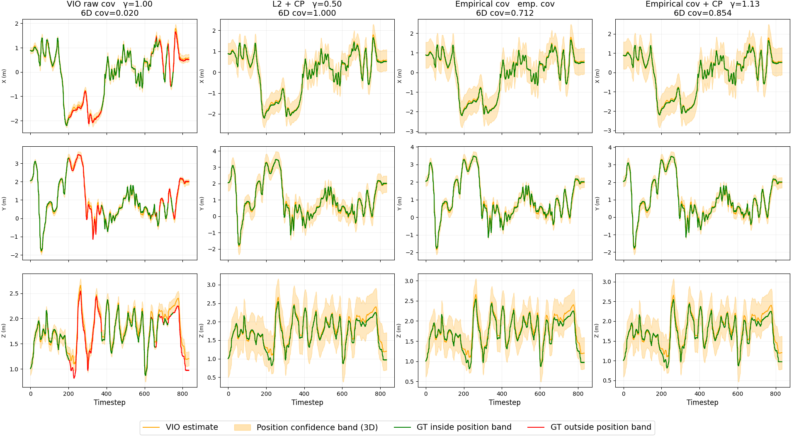
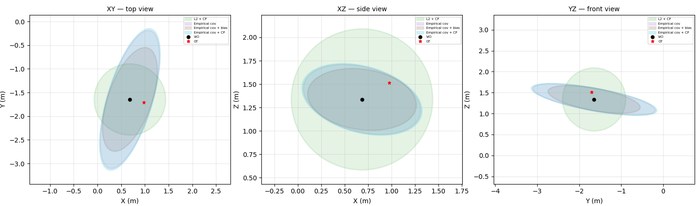

# violiese3

This project is based on the CLAPS benchmark (https://github.com/UM-ARM-Lab/claps_code.git), extending its approach to SE(3). The environment dependencies are listed in `requirements.txt`.

The pose estimation data from EuRoC, obtained through OpenVINS, is used as input for our approach and is stored in  `data/VIO`.

To generate calibration and validation datasets in `.pt` fromat

```
python data_creator.py
```
The trajectory segmentation (chunk size) can be configured within this script.


To visualize the VIO estimation performance:
```
python data_creator.py --plot <csv_file_path>
```

Once the calibration (e.g., easy environments) and validation (e.g., difficult environments) splits are defined, compute the baselines and CLAPS using:
```
python minimal_run.py
```
This script implements the SE(3) formulation and the conformal prediction framework. Results, including scale factors, are stored in `<robot_name>/experiments`

To visualize uncertainty calibration results:
 ```
python plot_results.py                                                                                                                                
```
This script shows how the application of CP improves uncertainty quantification, achieving user-defined coverage guarantees.


To analyze uncertainty regions at specific timesteps:

 ```
python plot_ellipsoids.py                                                                                                                                
```

